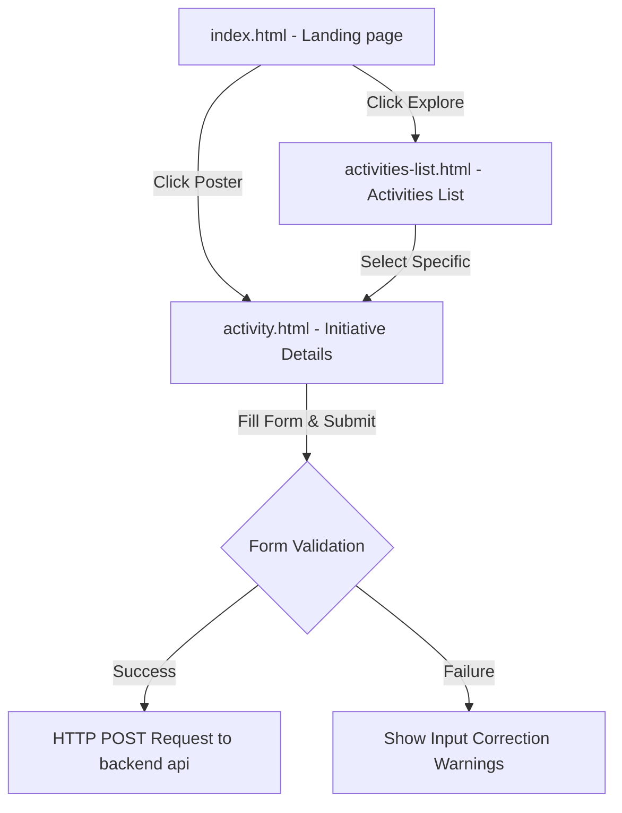

# Mobadratna Student Portal: Responsive Student Initiatives & Volunteer Portal

<div align="center">
  
</div>

<div align="center">
     
</div>

منصة **بوابة الطلاب لمبادرتنا** هي واجهة تفاعلية كاملة تمكن الطلاب من تصفح كافة المبادرات الجامعية المتاحة، والتقديم كمتطوعين في الفعاليات والأنشطة المناسبة لاهتماماتهم.

This repository houses the high-fidelity responsive frontend template, styling systems, and interactive panels for the **Mobadratna Student Portal**. Built using semantic HTML5, custom CSS variables, and vanilla JavaScript DOM logic.

---

## 🧬 System Interfaces & Layouts

The portal contains the complete UI screen layouts and component flows:

1.  **Main Landing Hub (`index.html`)**: Complete responsive interface presenting active initiative cards, dynamic statistics metrics, and voluntary program highlights.
2.  **Activities Directory (`activities-list.html`)**: Interactive list interface allowing users to search and discover different initiative packages.
3.  **Initiative Detail View (`activity.html`)**: Detailed panel showing program hosts, timeline schedules, active volunteer count, and voluntary participation check-in form.

---

## 🧬 UI Interaction Flow

The static screens manage frontend validation and views transitions logically:



---

## 🛠️ Technology Stack & Styling Assets

*   **Structure**: Semantic HTML5 markup built for screen-reader compatibility and SEO layouts.
*   **Design Engine**: Custom vanilla CSS3 utilizing flexible systems (Flexbox, CSS Grid) and responsive media breakpoints for desktop, tablet, and mobile displays.
*   **Logic Handler**: Vanilla JavaScript DOM controllers managing sidebar drawers, popup modals, search filters, and volunteer form validations.
*   **Typography**: Styled using Cairo Google Font to ensure professional, readable Arabic text presentation.

---

## 📂 Repository Module Layout

```text
mobadratna-student-portal/
├── css/                   # Stylesheets (layouts, variables, cards)
├── images/                # Graphic assets and system banners
├── js/                    # Vanilla JS handlers for interactive elements
├── index.html             # Ecosystem landing page
├── activities-list.html   # Initiative search registry page
└── activity.html          # Individual initiative dashboard details
```

---

## ⚡ Local Setup & Execution

Since the project consists of compiled static assets, it has no package build steps or dev runtime dependencies:

```bash
# 1. Clone the organization repository
git clone https://github.com/Mobadratna-Org/mobadratna-student-portal.git
cd mobadratna-student-portal

# 2. Run a local server (e.g. using Python, Live Server, or Nginx)
# Python 3 example:
python -m http.server 8080

# 3. Open http://localhost:8080 in your browser
```

---

## 📄 License
Licensed under the **MIT License**.
